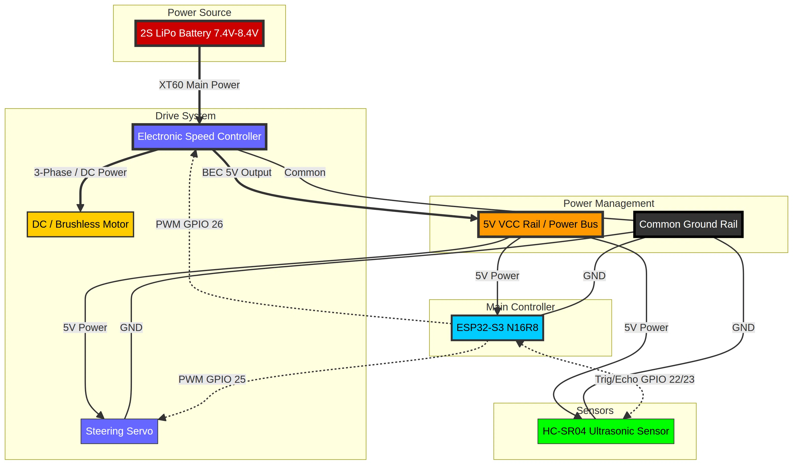

# Minas Documentation: Hardware & Wiring

**Author:** Eyal Braun**Last Updated:** August 13, 2026

---

## 1. Hardware Architecture Overview

This directory contains the technical documentation for the **Minas** project hardware. The system is designed around a high-performance **ESP32-S3** microcontroller, optimized for real-time telemetry and future AI integration.

### **The Wiring Diagram**

The core of our hardware design is illustrated in the **Minas Wiring Diagram**. This professional-grade schematic shows the integration of the following subsystems:

- **Power Source:** A high-capacity 2S LiPo battery (7.4V - 8.4V).

- **Power Management:** An Electronic Speed Controller (ESC) with a built-in Battery Eliminator Circuit (BEC) providing a stabilized 5V rail to the common Power Bus.

- **Main Controller:** The ESP32-S3 (N16R8) managing all signals and wireless communication via ESP-NOW.

- **Actuators:** High-torque Steering Servo and Brushless/DC Motor.

- **Sensors:** HC-SR04 Ultrasonic sensor for collision avoidance.

---

## 2. Technical Diagram

*Note: In the diagram, ****Thick Lines**** represent high-current power flow, while ****Dashed Lines**** represent low-voltage PWM and logic signals.*

---

## 3. Video Demonstration (Coming Soon)

We are currently in the final assembly and testing phase. A comprehensive video demonstration showing **Minas** driving, performing obstacle avoidance, and streaming real-time telemetry will be uploaded here shortly.

**Stay tuned for the future of autonomous RC systems!**
