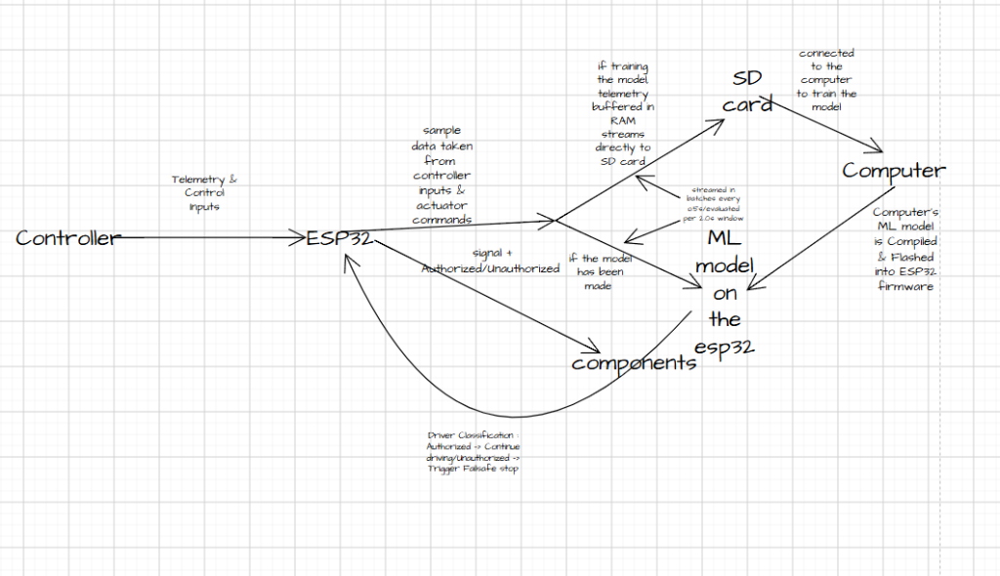
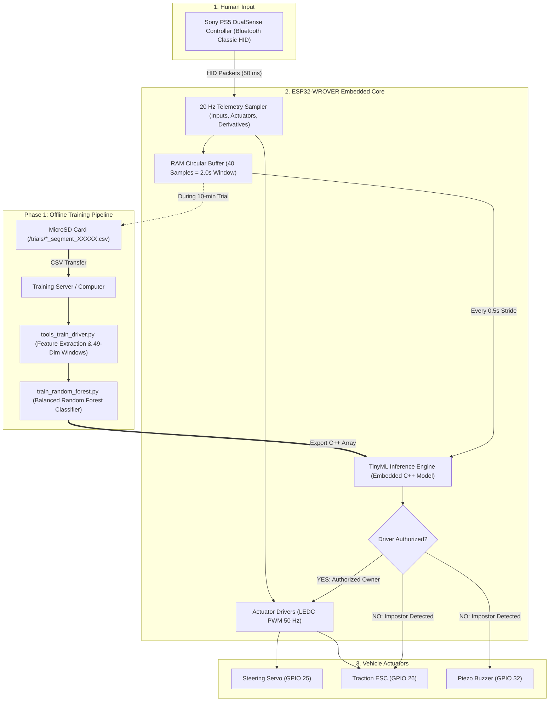
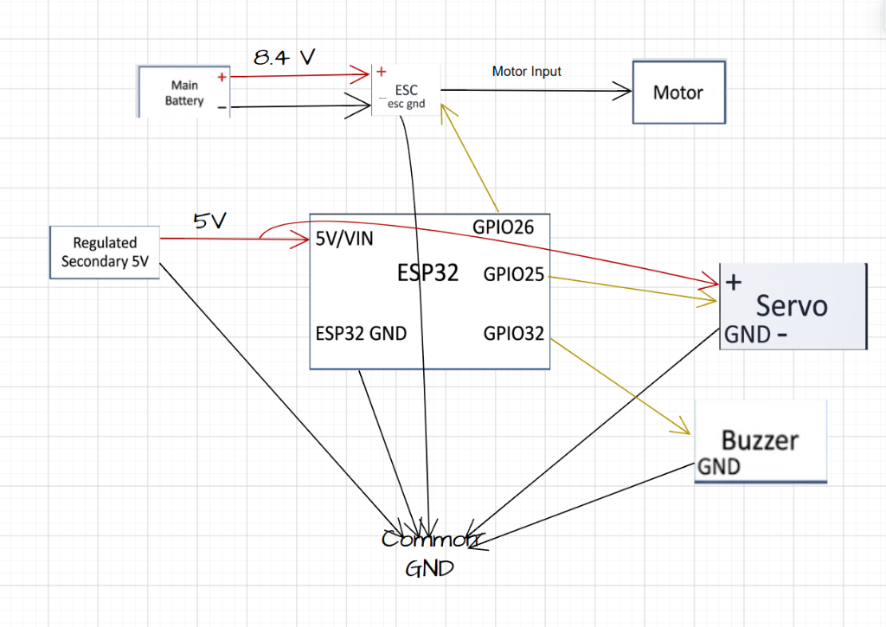

# Minas: Continuous Driver Authentication Using TinyML on ESP32

[](https://platformio.org/)
[](https://isocpp.org/)
[](https://scikit-learn.org/)
[](https://www.espressif.com/)
[](LICENSE)

An autonomous, embedded cyber-physical security system that continuously identifies and authenticates an RC vehicle driver in real time using **Behavioral Biometrics** and **Edge TinyML (Tiny Machine Learning)** running directly on an ultra-low-cost **ESP32-WROVER** microcontroller.

---

## 📑 Table of Contents
1. [Executive Summary & Vision](#-executive-summary--vision)
2. [End-to-End System Architecture & Data Flow](#-end-to-end-system-architecture--data-flow)
3. [Hardware Architecture & Electrical Wiring](#-hardware-architecture--electrical-wiring)
4. [Vehicle Control Scheme (Option A) & PS5 Integration](#-vehicle-control-scheme-option-a--ps5-integration)
5. [Experimental Protocol & 10-Minute Trial Collection](#-experimental-protocol--10-minute-trial-collection)
6. [Telemetry & Sliding-Window Feature Schema](#-telemetry--sliding-window-feature-schema)
7. [Machine Learning Pipeline & Model Training](#-machine-learning-pipeline--model-training)
8. [Firmware Architecture & Hardware Timer Safety](#-firmware-architecture--hardware-timer-safety)
9. [Build, Flash & Verification Guide](#-build-flash--verification-guide)
10. [Repository Structure](#-repository-structure)
11. [Academic References & License](#-academic-references--license)

---

## 🚀 Executive Summary & Vision

Traditional automotive anti-theft security relies on **one-time static authentication at startup** (physical keys, smart fobs, keyless entry, or fingerprint push-buttons). Once the vehicle is in motion, traditional systems suffer from critical security blind spots:
* **Relay Attacks & Fob Cloning:** Stolen or electronically cloned credentials allow unauthorized vehicle operation.
* **Carjacking & Coercion:** If a vehicle is forcibly taken while running, the vehicle cannot determine that the authorized driver is no longer at the controls.
* **Fleet & Commercial Security:** Logistics operators, car-sharing services, and rental fleets cannot continuously verify driver identity without privacy-invasive cameras.

### The Minas Solution: Zero-Trust Continuous Behavioral Biometrics
**Minas** introduces an active, embedded security gatekeeper:
1. **Neuromotor Behavioral Biometrics:** Every human driver possesses a unique, subconscious "motor signature"—fine-grained steering micro-adjustments, trigger pressure gradients, throttle onset rates, and control derivative profiles ($\Delta\text{Steering}, \Delta\text{Throttle}$).
2. **Edge AI / TinyML:** Instead of streaming high-frequency telemetry to a vulnerable remote cloud server (introducing network latency, connectivity dependency, and privacy risks), classification is performed **100% locally on the ESP32-WROVER**.
3. **Active Cyber-Physical Mitigation:** When an unauthorized driver operates the vehicle, the microcontroller triggers an instant hardware failsafe: neutralizes the Electronic Speed Controller (ESC 1500 µs), centers the steering, and activates an acoustic alarm buzzer.

---

## 🔄 End-to-End System Architecture & Data Flow

The project operates across a two-phase lifecycle: **Phase 1 (Data Collection & Training)** and **Phase 2 (Edge Inference & Cyber-Physical Protection)**.





### Operational Phases:
1. **Phase 1 — Ground Truth Data Collection:**
   - The ESP32 samples user inputs and vehicle commands at a strict **20 Hz rate (every 50 ms)**.
   - Telemetry is buffered in RAM and streamed directly to an onboard MicroSD card via 1-bit SDMMC.
   - Structured 10-minute trials are recorded for the legitimate **Owner** (Circle button) and **Non-Owner Impostors** (Square button).
   - Completed CSV logs are transferred to a PC for automated sliding-window feature extraction and model training.
2. **Phase 2 — Real-Time Edge Inference:**
   - The trained classifier is compiled into the ESP32 firmware.
   - Live driving dynamics are evaluated across a **2.0-second sliding window** (40 samples, stepped every 0.5 seconds).
   - If an unauthorized driver is detected, the ESP32 overrides control, shuts down the motor, and sounds the alarm.

---

## ⚡ Hardware Architecture & Electrical Wiring

Reliable operation of high-current actuators alongside an RF-sensitive microcontroller requires clean electrical isolation and a unified ground plane.



### Complete Wiring & Pinout Table

| Peripheral | Board Pin | Electrical Spec | Subsystem Function |
|---|---|---|---|
| **Steering Servo Signal** | `GPIO 25` | 3.3V Logic PWM (50 Hz) | Controls steering angle ($0^\circ$ to $180^\circ$, neutral $90^\circ$). |
| **ESC Throttle Signal** | `GPIO 26` | 3.3V Logic PWM (50 Hz) | Electronic Speed Controller throttle ($1000\,\mu\text{s}$ to $2000\,\mu\text{s}$, neutral $1500\,\mu\text{s}$). |
| **Piezo Buzzer (+)** | `GPIO 32` | 3.3V Square Wave (`safeBeep`) | Acoustic feedback without LEDC timer hijacking. |
| **MicroSD Card Bus** | `GPIO 2, 14, 15` | 1-bit Hardware SDMMC | High-speed logging (D0: GPIO 2, CLK: GPIO 14, CMD: GPIO 15). |
| **Internal SPI PSRAM** | `GPIO 16, 17` | Reserved (Do Not Wire!) | Dedicated to 4MB onboard Pseudo-Static RAM. |
| **Internal SPI Flash** | `GPIO 6–11` | Reserved (Do Not Wire!) | Dedicated to onboard 4MB SPI Flash memory. |

### ⚠️ Critical Electrical Design Rules:
1. **Common Ground (GND) Bus:** All grounds (Main Battery GND, Secondary 5V GND, ESP32 GND, Servo GND, ESC GND, Buzzer GND) **must be tied together** to establish a shared reference potential for PWM signals.
2. **Isolated Servo Power:** **Never power an RC servo from the ESP32 3.3V or 5V USB pin!** High-torque servos draw $1.0\text{A}$ to $2.5\text{A}$ stall current during steering turns. Power the servo from a dedicated **Regulated Secondary 5V supply** (UBEC or separate $5\text{V}$–$6\text{V}$ pack).
3. **ESC BEC Isolation:** When using a dedicated secondary 5V pack for the microcontroller and servo, the red wire ($5\text{V}$ BEC) of the ESC receiver plug must be disconnected/insulated to prevent regulator cross-currents.

---

## 🎮 Vehicle Control Scheme (Option A) & PS5 Integration

Minas uses standard automotive dual-trigger control (**Option A**), configured specifically for the Sony PS5 DualSense controller:

| Control Input | Controller Action | Vehicle Response | Data Mapping Range |
|---|---|---|---|
| **Steering** | **Left Stick (X-Axis)** | Steers front wheels Left / Right | $-128 \dots +127 \longrightarrow 0^\circ \dots 180^\circ$ (Center: $90^\circ$) |
| **Throttle** | **R2 Analog Trigger** | Progressive Forward Acceleration | $0 \dots 255 \longrightarrow 0.0\% \dots +100.0\%$ ($1500 \dots 2000\,\mu\text{s}$) |
| **Brake / Reverse** | **L2 Analog Trigger** | Progressive Braking / Reverse Drive | $0 \dots 255 \longrightarrow 0.0\% \dots -100.0\%$ ($1500 \dots 1000\,\mu\text{s}$) |
| **Owner Trial** | **Circle (○) Button** | Starts 10-Minute Recorded Owner Trial | Emits $2200\text{ Hz}$ confirmation chime |
| **Non-Owner Trial** | **Square (□) Button** | Starts 10-Minute Recorded Non-Owner Trial | Emits $1200\text{ Hz}$ confirmation chime |
| **Cancel / Finish** | **Cross (✕) Button** | Cancel ($<10\text{ min}$) or Finish ($\ge 10\text{ min}$) | Warning buzz or high victory chime |

### Built-in Deadband & Safety Features:
* **Trigger Deadband (20 units):** Prevents creeping caused by the physical resting weight of the DualSense controller on a flat surface.
* **Steering Deadband (10 units):** Eliminates center stick drift.
* **ESC Neutral Arming:** The firmware holds neutral ($1500\,\mu\text{s}$) for 2.0 seconds at boot to properly calibrate and arm the ESC.
* **Controller Disconnect Failsafe:** If Bluetooth connection is lost, failsafe activates within $50\text{ ms}$ (motor stops, steering centers).

---

## ⏱️ Experimental Protocol & 10-Minute Trial Collection

To prevent machine learning models from merely memorizing a specific track layout rather than learning true behavioral biometrics, data collection follows a structured **multi-driver, multi-track protocol**:

```
+-----------------------------------------------------------------------------+
|                          EXPERIMENTAL TRACK SUITE                           |
+-----------------------------------------------------------------------------+
|  Track A (Straight Line)  | Long straightaway: high-speed acceleration,     |
|                           | threshold braking, and launch dynamics.         |
+---------------------------+-------------------------------------------------+
|  Track B (Curved Course)  | 90° hairpin turns, sweeping wide bends,         |
|                           | and rapid directional transitions.              |
+---------------------------+-------------------------------------------------+
|  Track C (Slalom Course)  | Variable-spaced cone obstacles requiring rapid, |
|                           | continuous steering adjustments.                |
+---------------------------+-------------------------------------------------+
|  Track D (Held-Out Test)  | COMPLETELY UNSEEN course configuration used     |
|                           | EXCLUSIVELY to test model generalization!       |
+-----------------------------------------------------------------------------+
```

### Dataset Structure (16 Complete Trials = 160 Minutes of Driving):
* **1 Authorized Owner:** 4 trials $\times$ 10 min = 40 minutes total.
* **3 Impostor Non-Owners:** 4 trials $\times$ 10 min each = 120 minutes total.
* **Strict Whole-Session Split:** The held-out evaluation dataset uses completely independent session files to prevent **data leakage** across overlapping time windows.

---

## 📊 Telemetry & Sliding-Window Feature Schema

### Raw CSV Format (Recorded at 20 Hz / Every 50 ms)
Files are stored under `/trials/owner_segment_XXXXX.csv` or `/trials/nonowner_segment_XXXXX.csv`. Each file begins with metadata headers followed by 20 data columns:

```csv
schema_version=3
firmware_version=minas-10min-no-sonar-v3
label=owner
is_owner=1
sample_interval_ms=50
planned_duration_ms=600000
features=controller_and_actuators_only
---
segment_number,sample_sequence,timestamp_ms,elapsed_ms,label,is_owner,controller_connected,raw_lx,raw_ly,raw_rx,raw_ry,l2,r2,buttons_mask,steering_deg,throttle_percent,steering_command_deg,esc_command_us,steering_delta,throttle_delta
```

### The 49 Sliding-Window Features:
The preprocessing pipeline slices continuous driving into **40-sample windows** ($2.0\text{ seconds}$ at $20\text{ Hz}$) with a **10-sample step** ($0.5\text{ seconds}$ stride). Across the 12 core numeric dimensions, 4 statistical moments are computed:

$$\text{Features} = \{\text{mean}, \text{std}, \text{min}, \text{max}\} \times 12\text{ Signals} + \{\text{controller\_connected\_ratio}\} = \mathbf{49\text{ Features}}$$

1. `raw_lx` (Steering stick X)
2. `raw_ly` (Left stick Y)
3. `raw_rx` (Right stick X)
4. `raw_ry` (Right stick Y)
5. `l2` (Brake/Reverse trigger)
6. `r2` (Throttle trigger)
7. `steering_deg` (Normalized steering intent: $0^\circ \dots 180^\circ$)
8. `throttle_percent` (Net signed throttle: $-100\% \dots +100\%$)
9. `steering_command_deg` (Actuator steering command)
10. `esc_command_us` (Actuator ESC pulse: $1000 \dots 2000\,\mu\text{s}$)
11. `steering_delta` (First derivative $\Delta\text{Steering}/\Delta t$)
12. `throttle_delta` (First derivative $\Delta\text{Throttle}/\Delta t$)

---

## 🧠 Machine Learning Pipeline & Model Training

### 1. Extract Features & Split Dataset
Run [`tools_train_driver.py`](tools_train_driver.py) to validate trial logs, perform a balanced class-stratified split (12 training files, 4 held-out evaluation files), and generate tabular sliding windows:

```bash
python tools_train_driver.py \
  --data-dir data/raw \
  --out-dir data/processed \
  --window 40 \
  --stride 10 \
  --seed 20260908
```

**Output Artifacts:**
* `data/processed/train_raw/`: 12 training trial CSVs (6 owner, 6 non-owner).
* `data/processed/test_raw/`: 4 held-out evaluation CSVs (2 owner, 2 non-owner).
* `data/processed/train_window/windows.csv`: Extracted training feature matrix.
* `data/processed/test_window/windows.csv`: Extracted test feature matrix.
* `data/processed/split_report.json`: Full reproducibility and audit report.

### 2. Train Random Forest Classifier
Run [`train_random_forest.py`](train_random_forest.py) to train an optimized Random Forest and evaluate security metrics:

```bash
python train_random_forest.py \
  --train data/processed/train_window/windows.csv \
  --test data/processed/test_window/windows.csv \
  --model-out data/models/driver_rf.joblib \
  --metrics-out data/models/metrics.json \
  --trees 300
```

### Security Benchmark Targets:
* **Classification Accuracy:** $> 90.0\%$
* **False Acceptance Rate (FAR):** $< 5.0\%$ (Strict priority: unauthorized drivers must not gain control)
* **False Rejection Rate (FRR):** $< 10.0\%$
* **Inference Latency on ESP32:** $< 50\text{ ms}$ per evaluation window

---

## 🛡️ Firmware Architecture & Hardware Timer Safety

### The ESP32 `tone()` LEDC Timer Conflict (Root Cause & Resolution)
On the ESP32 architecture, the Arduino core function `tone()` shares the same 4 hardware LEDC timers used by the `ESP32Servo` library for 50 Hz PWM generation:
* **The Vulnerability:** Calling `tone(pin, freq)` reconfigures the underlying timer frequency from $50\text{ Hz}$ to the audio frequency (e.g., $1800\text{ Hz}$). When the audio stops, the timer is left corrupted.
* **The Physical Symptom:** The ESC receives an ultra-high frequency signal interpreted as $100\%$ Full Throttle, causing the car to launch unexpectedly, while the steering servo freezes in place.
* **The Minas Solution (`safeBeep`):** The firmware eliminates all calls to `tone()`. Audio feedback is generated using `safeBeep(freq, duration)`, a non-blocking bit-banged routine that toggles `BUZZER_PIN` with microsecond precision **without touching or altering any hardware PWM timers**:

```cpp
void safeBeep(uint32_t freqHz, uint32_t durationMs) {
    if (freqHz == 0 || durationMs == 0) return;
    uint32_t periodUs = 1000000UL / freqHz;
    uint32_t halfPeriodUs = periodUs / 2;
    uint32_t cycles = (durationMs * 1000UL) / periodUs;
    for (uint32_t i = 0; i < cycles; i++) {
        digitalWrite(BUZZER_PIN, HIGH);
        delayMicroseconds(halfPeriodUs);
        digitalWrite(BUZZER_PIN, LOW);
        delayMicroseconds(halfPeriodUs);
    }
}
```

---

## 🛠️ Build, Flash & Verification Guide

### Prerequisites
* [PlatformIO](https://platformio.org/) installed in VS Code or PlatformIO Core CLI.
* Python 3.10+ with `pandas`, `scikit-learn`, `joblib`.

### 1. Set Controller Bluetooth MAC Address
Open [`include/Config.h`](include/Config.h) and set your PS5 controller's Bluetooth MAC address:
```cpp
#define PS5_CONTROLLER_MAC "14:3a:9a:d1:f4:0a"
```

### 2. Compile & Flash Firmware
```bash
# Build binary
pio run

# Flash to ESP32 over serial (e.g., COM3)
pio run --target upload --upload-port COM3

# Monitor live telemetry (115200 baud)
pio device monitor --port COM3
```

### 3. Live Control Verification
Once paired, the serial monitor streams real-time status:
```text
[PS5] >>> CONTROLLER CONNECTED & READY! <<<
[LIVE CTRL] L2:  0 R2:  0 | Throt: +0.0% | ESC:1500 us | Steer: 90 deg | State:STANDBY_NEUTRAL
```

---

## 📁 Repository Structure

```text
Minas/
├── include/
│   └── Config.h                  # Hardware GPIO pinouts, timing, and limits
├── src/
│   ├── main.cpp                  # 20 Hz control loop, SD logger, safeBeep firmware
│   └── main_car_full.cpp.bak     # Reference backup
├── docs/
│   └── images/
│       ├── system_flow.png       # Complete system architecture and data flow diagram
│       └── wiring_schematic.png  # Electrical schematics and pin interconnection diagram
├── data/
│   ├── raw/                      # Ingest folder for raw 10-minute SD trial CSVs
│   ├── processed/                # Extracted 49-dim sliding windows & datasets
│   └── models/                   # Trained Random Forest models & benchmark metrics
├── tools_train_driver.py         # Window extraction, dataset splitting, and audit tool
├── train_random_forest.py        # Random Forest model training & security evaluation
├── platformio.ini                # PlatformIO build settings, ESP32-WROVER env, libraries
└── README.md                     # Comprehensive project documentation
```

---

## 📚 Academic References & License

1. **Baldini, G., Geib, F., & Giuliani, R. (2019).** *Continuous Authentication of Automotive Vehicles Using Inertial Measurement Units.* Sensors, 19(23), 5283.
2. **Efatinasab, E., Marchiori, F., Donadel, D., Brighente, A., & Conti, M. (2024).** *When Authentication Is Not Enough: On the Security of Behavioral-Based Driver Authentication Systems.* arXiv:2306.05923.
3. **Warden, P., & Situnayake, D. (2019).** *TinyML: Machine Learning with TensorFlow Lite on Arduino and Ultra-Low-Power Microcontrollers.* O'Reilly Media.
4. **Martinelli, F., Mercaldo, F., Nardone, V., & Santone, A. (2018).** *Car-Driver Identification Through CAN Bus Data Analysis.* IEEE Transactions on Intelligent Transportation Systems.

Distributed under the **MIT License**. See `LICENSE` for details.
